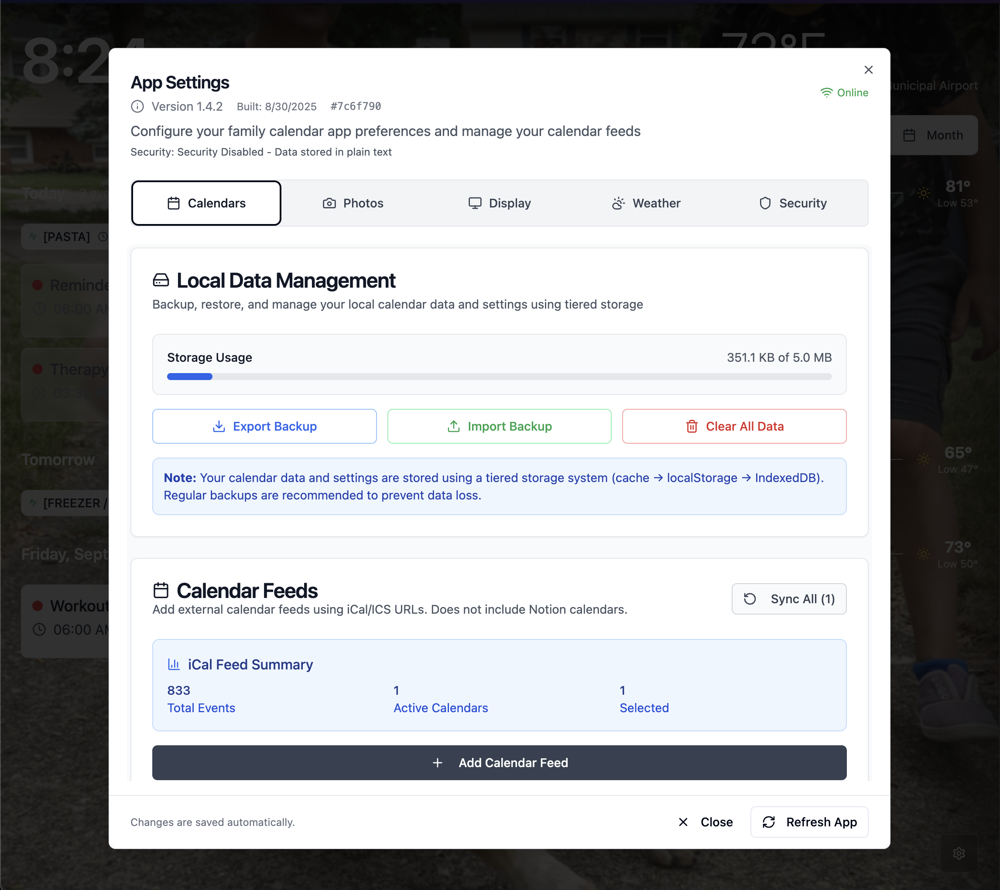

# Family Photo Calendar Flow

Privacy-first family calendar + rotating photo display with offline support, encrypted settings, Notion + iCal aggregation, background sync, weather, and installable PWA – all running 100% in the browser (no backend required).


*Main calendar interface (placeholder illustration – replace with a real screenshot)*


*Settings modal with tabbed navigation (placeholder illustration)*

## 🌟 Feature Overview

### 📅 Calendars & Events

- Month, Week, and Timeline views (responsive)
- iCal feed support (Google Calendar, Outlook, iCloud, etc.)
- Notion database scraping (multiple pages via automatic pagination)
- Local events (fully offline capable)
- Integrated unified event layer (merges local + feeds + Notion)
- Fast filtering by calendar sources
- Recurring event expansion (RRULE parsing)
- Day modal & timeline drill‑downs

### 🔒 Security & Privacy

- Client-side encryption (AES‑256‑GCM) for sensitive settings
- PBKDF2 key derivation – keys never written to disk
- Optional password lock for protected settings (weather location, album URLs, etc.)
- Strict input validation & sanitization (XSS / traversal / protocol guards)
- No external servers: all persistence in local browser storage (IndexedDB + localStorage)

### 🚀 Progressive Web App & Updates

- Installable PWA (offline-first)
- Service worker asset updates (auto detection + in‑app notification)
- Version JSON manifest (`public/version.json`)
- Lightweight top progress bar reflects real sync phases (start → complete)
- (Optional) Upstream release comparison (GitHub) – can be re‑enabled if needed

### 🌤️ Weather

- National Weather Service (no API key required)
- Auto geolocation (fallback to manual lat,long)
- Daily + extended forecasts (cached)
- Offline reuse of last-known forecast

### 📸 Rotating Photo Backgrounds

- Google Photos public album scraping
- Lightweight heuristic filtering (skips profile/UI artifacts, tiny images <50px)
- Interval-based rotation & prefetch
- Local caching for offline continuity

### 🔄 Sync & Performance

- Background refresh for feeds & Notion sources
- Start/complete phase events for accurate loader timing
- IndexedDB event cache
- Graceful offline behavior (reads cached events + photos)

## 🏗️ Architecture Snapshot

### Frontend Stack

- React 18 + TypeScript
- Vite build tooling
- Tailwind CSS + shadcn/ui + Radix primitives
- Custom hook-driven modular data layer

### Data & Storage

- React Context + custom hooks
- IndexedDB (events, photos)
- localStorage (lightweight flags + encrypted blobs)
- Web Crypto API abstraction layer

### Security Implementation

- AES-256-GCM
- PBKDF2 (100k iterations)
- Random per-user salt + per-encryption IV
- Sanitizers for URL & text inputs
- Ephemeral in‑memory key lifecycle

### Update / Versioning Layer

- Service worker + version manifest
- Optional GitHub release polling (currently minimized)
- UI toast + in-app notification pattern

## 🚀 Quick Start

### Prerequisites

- **Node.js** 18.0 or higher
- **npm** or **yarn** package manager
- Modern web browser with Web Crypto API support

### Installation

1. **Clone the repository**

   ```bash
   git clone https://github.com/your-username/family-calendar.git
   cd family-calendar
   ```


2. **Install dependencies**

```bash
npm install
# or
yarn install
```

1. **Start development server**

```bash
npm run dev
# or
yarn dev
```

1. **Open your browser**

   Navigate to `http://localhost:5173`

### Building for Production

```bash
# Build the application
npm run build

# Preview the build locally
npm run preview
```

## 🌐 Hosting & CI/CD (GitHub Pages + Workflows)

This repository ships with a fully automated GitHub Actions pipeline covering: build/test/lint/security, auto & manual releases, and GitHub Pages deployment.

### 🔁 Overview Matrix

| Area | File | Trigger | Purpose |
|------|------|---------|---------|
| Deploy (Pages) | `.github/workflows/deploy-pages.yml` | push to `main`, manual dispatch | Builds & publishes `dist/` to GitHub Pages |
| CI (quality) | `.github/workflows/ci.yml` | push & PR to `main` | Lint, tests (Node 18 & 20), security audit |
| Auto release | `.github/workflows/auto-release.yml` | push to `main` (filtered) | Semantic-ish auto bump + tag + release + `version.json` update |
| Manual release | `.github/workflows/release.yml` | manual (workflow_dispatch) | Controlled version bump & changelog generation |

---

### 🚀 GitHub Pages Deployment

The app deploys automatically on each push to `main` using `deploy-pages.yml`.

Key characteristics:

- Concurrency guarded (only one deployment runs at a time)
- Uses Node `24.1.0` (aligns with `package.json` engines for production build)
- Builds with `vite build --base=/` because a custom domain + `public/CNAME` is present
- Adds `.nojekyll` & copies `CNAME` into `dist/`

#### 1. Enable Pages

In the GitHub repository UI:

1. Settings → Pages
2. Source: GitHub Actions (this workflow handles deployment)

#### 2. Custom Domain (Optional)

Add a DNS CNAME record:

```text
calendar  CNAME  <your-username>.github.io
```

Then keep (or create) `public/CNAME` containing your domain (already present for this repo).

#### 3. Forking / Using Under a Project Page

If you are *not* using a custom domain (project page like `https://<user>.github.io/<repo>/`):

1. Delete or rename `public/CNAME`
1. Change build step in `deploy-pages.yml` to:

   ```bash
   npx vite build --base="/${{ github.event.repository.name }}/"
   ```

1. Or add a script in `package.json`:

   ```json
   "build:pages": "vite build --base=/${npm_package_name}/" 
   ```

1. Update workflow to run `npm run build:pages` instead of the current custom build command.

#### 4. Local Preview

```bash
npm run build
npm run preview
```

#### 5. Common Deployment Adjustments

| Goal | Change |
|------|--------|
| Use different Node version | Update `node-version` in workflow(s) |
| Add environment banner | Inject `VITE_APP_ENV` via build step (`echo 'VITE_APP_ENV=prod' >> $GITHUB_ENV`) |
| Skip lint/tests on deploy | Remove or comment out steps (not recommended) |
| Force re-deploy only | Re-run workflow manually (Actions → Deploy to GitHub Pages → Run workflow) |

---

### ✅ CI Quality Pipeline (`ci.yml`)

Jobs:

1. `validate-commits` (PR only): commitlint checks conventional commit style
2. `test` (matrix Node 18 & 20): install → ESLint → Vitest → build → upload build artifact (Node 18 only)
3. `security`: `npm audit` (auto-fix high severity where possible). Fails build if high/critical vulnerabilities remain.

Notes:

- Engines mismatch: production deploy uses Node 24.1.0; CI tests 18 & 20. Align if features rely on Node 20+ APIs.
- Commitlint only runs in PR context (push to `main` bypasses it). Enable for pushes if desired.

---

### 🤖 Auto Release (`auto-release.yml`)

Runs on push to `main` excluding docs / config changes. Skips if commit message contains `[skip-release]` or is itself a release commit (`chore(release)`).

Flow:

1. Install deps
2. Attempt security auto-fix
3. Run tests
4. Gate on high/critical vulnerabilities
5. Decide bump type:
   - BREAKING CHANGE / `!` → major
   - `feat:` → minor
   - else → patch
6. Safely find next available version tag (avoids collisions)
7. Update `public/version.json` (increments `buildNumber`, adds git hash & timestamp)
8. Commit with `[skip-release]` to prevent recursion
9. Create tag + GitHub Release with minimal notes

Commit message examples:

| Commit | Resulting Bump |
|--------|----------------|
| `feat(calendar): add multi-select` | minor |
| `fix(photos): handle empty album` | patch |
| `refactor: optimize query` | patch |
| `feat!: change encryption default` | major |

Disable auto release: rename file, change `on.push`, or add a path filter.

---

### 🎛 Manual Release (`release.yml`)

Triggered via Actions → Release → Run workflow (inputs available):

- `version_type`: `auto | patch | minor | major`
- `skip_tests`: boolean

Pipeline uses composite actions (setup, version, changelog, git ops) then creates a full GitHub Release with optional build artifact zip.

Use manual release when:

- You want a curated changelog
- Bundling multiple small commits into one semantic version
- Overriding auto bump logic

---

### 🔄 Version & Build Metadata

`public/version.json` is the canonical runtime version manifest (used by in‑app update detection). Auto & manual releases should keep this file current. If you create custom pipelines, be sure to update:

```json
{
  "version": "x.y.z",
  "buildDate": "ISO-8601",
  "gitHash": "shortSHA",
  "buildNumber": <int>,
  "environment": "production"
}
```

Incrementing `buildNumber` helps the PWA detect asset freshness even if semantic version stays constant.

---

### 🔐 Secrets & Permissions

Current workflows rely only on the default `GITHUB_TOKEN`.

Add secrets (e.g. `NOTION_API_KEY`) by:

1. Settings → Secrets and variables → Actions → New repository secret
2. Reference in workflow: `${{ secrets.NOTION_API_KEY }}`

Avoid printing secret-derived values to logs.

---

### 🧪 Recommended Pre-Deployment Checklist

1. `npm run lint`
2. `npm test`
3. `npm run build` (verify no warnings you care about)
4. Open `dist/` via `npm run preview`
5. Increment version (manual or rely on auto release)

---

### 🛠 Migrating to Another Host

For Netlify / Vercel:

| Platform | Build Command | Publish Dir | Extra |
|----------|---------------|-------------|-------|
| Netlify | `npm run build` | `dist` | Set environment vars in dashboard |
| Vercel | `npm run build` | `dist` | Add `"output": "export"` if using static export features |

Ensure you remove GitHub Pages specific `--base` overrides if you add them for project pages.

---

### 🧹 Disabling Components

| Need | Action |
|------|--------|
| Stop auto releases | Delete / rename `auto-release.yml` |
| Skip security audit | Remove `security` job in `ci.yml` |
| Keep manual only | Use `release.yml` exclusively |
| Disable Pages | Turn off in Settings → Pages + remove workflow |

---

### ⚠️ Common Hosting Pitfalls

| Issue | Cause | Fix |
|-------|-------|-----|
| Blank screen after deploy | Wrong `--base` path | Match `--base` to deployment URL or `/` for custom domain |
| Old assets served | SW cache not updated | Hard refresh or bump `buildNumber` in `version.json` |
| Release not created | Commit message filtered | Remove `[skip-release]` or adjust auto release conditions |
| CSS missing | Dist not deployed fully | Ensure `dist/` artifact includes all assets |

---

### 📌 TL;DR

Push to `main` → CI validates → Auto release (if eligible) bumps version & publishes → Pages deploy updates live site.

Manual override always possible via Release workflow & re-run of Deploy workflow.

## ⚙️ Configuration & Setup

### Notion Integration (Scraped Calendars)

1. Create a Notion database with event rows (Date / Title fields recommended)
2. Share the database with the integration token you generate
3. Add the Notion API key & database ID in Settings → Calendars (encrypted if security enabled)
4. The app automatically paginates all results (no 100-item cap)
5. Events appear merged with other sources

### Update System (Optional Advanced)

If you re‑enable upstream release checks:

1. Set repository owner/name in the version manager utility
2. Ensure `public/version.json` syncs with build version
3. Service worker will prompt when assets change

### Weather Setup

1. **Automatic Location**: Allow browser geolocation when prompted (no API key needed)
2. **Manual Coordinates (Optional)**: Enter latitude,longitude in Settings → Weather
3. **Privacy**: Coordinates are stored locally (encrypted if security enabled)

### Google Photos Setup

1. **Create Public Album**: Make a Google Photos album publicly shareable
2. **Copy Album URL**: Get the public sharing link
3. **Configure in App**: Settings → Photos → Album URL

### Calendar Feeds

1. **Get iCal URLs**: From Google Calendar, Outlook, or other providers
2. **Add Feeds**: Settings → Calendars → Add Calendar Feed
3. **Sync Settings**: Configure automatic sync intervals

### Security Setup

1. **Enable Security**: Settings → Security → Enable Security
2. **Set Password**: Choose a strong password (minimum 8 characters)
3. **Confirm Setup**: Your sensitive data will now be encrypted

## 🔧 Development

### Project Structure (High-Level)

```text
src/
├── components/          # React components
│   ├── ui/             # Reusable UI components
│   ├── calendar/       # Calendar-specific components
│   └── settings/       # Settings panel components
├── contexts/           # React context providers
├── hooks/              # Custom React hooks
├── utils/              # Utility functions
│   ├── security/       # Encryption and security utilities
│   ├── googlePhotos/   # Photo integration utilities
│   ├── versionManager.ts        # Version tracking and comparison
│   ├── upstreamVersionManager.ts # GitHub API integration
│   └── updateManager.ts         # Update detection and management
├── services/           # External API services
├── types/              # TypeScript type definitions
└── data/               # Sample data and constants
```

### Key Components

#### Security System

- `SecurityContext.tsx` - Global security state management
- `secureStorage.ts` - Encrypted localStorage wrapper
- `encryption.ts` - Web Crypto API utilities
- `inputValidation.ts` - Input sanitization and validation

#### Progress & Sync Feedback

- Top progress bar (portal, high z-index, phased animation)
- Events dispatched via custom `calendar-refresh` with `phase: 'start' | 'complete'`

#### Calendar System

- `Calendar.tsx` - Main calendar component
- `useLocalEvents.tsx` - Local event management
- `useICalCalendars.tsx` - External calendar feeds

#### Settings System

- `SettingsModal.tsx` (tabbed: Calendars, Photos, Display, Weather, Security)
- Footer with manual global refresh

### Testing

```bash
# Run tests
npm test

# Run tests with coverage
npm run test:coverage

# Run E2E tests
npm run test:e2e
```

### Code Style

- **ESLint** - Code linting and formatting
- **Prettier** - Code formatting
- **TypeScript** - Strict type checking enabled

## 🔐 Security Model

### Encryption Details

- **Algorithm**: AES-256-GCM (authenticated encryption)
- **Key Derivation**: PBKDF2 with SHA-256 (100,000 iterations)
- **Salt**: Unique 128-bit random salt per user
- **IV**: Random 96-bit initialization vector per encryption

### Input Security

- **Sanitization**: HTML and script tag removal from user inputs
- **URL Validation**: Protocol validation and path traversal prevention
- **API Key Validation**: Format validation and secure storage
- **XSS Prevention**: Content Security Policy and input filtering

### Data Protection

- **API Keys**: Weather and calendar service keys encrypted
- **Personal Data**: Zip codes and album URLs encrypted
- **Session Security**: Encryption keys exist only in memory
- **Local Storage**: All data remains on user's device

### Threat Model

- **Protects Against**: Local storage inspection, device theft, XSS attacks, injection attacks
- **Limitations**: Not protected against malware or browser vulnerabilities
- **Recovery**: No password recovery - users must remember passwords

## 🔄 Update Management (Condensed)

### Update Detection System

- **Service Worker Updates**: Immediate updates for app changes
- **GitHub Releases**: Upstream updates from the official repository
- **Automatic Checking**: Hourly checks for GitHub releases
- **Smart Caching**: Intelligent caching with configurable refresh intervals

### Update Process

1. **Background Detection**: Automatic checking during app usage
2. **User Notification**: Toast notifications and persistent update cards
3. **Release Information**: Display of release notes and version details
4. **One-Click Installation**: Easy update installation for service worker updates
5. **External Updates**: Direct links to GitHub releases for major updates

### Version Management

- **Semantic Versioning**: Proper version comparison (major.minor.patch)
- **Version Tracking**: Local version storage and comparison
- **Update Types**: Classification of updates as major, minor, or patch
- **Rollback Support**: Version history and rollback capabilities

## 🛠 Self-Hosting Notes

```bash
# Build for production
yarn run build

# Deploy dist/ folder to your web server
# Ensure HTTPS is enabled for Web Crypto API
```

### Update Configuration for Self-Hosting

1. **GitHub Repository**: Update repository details in `upstreamVersionManager.ts`
2. **Version File**: Ensure `public/version.json` is updated during build
3. **Service Worker**: Configure service worker for your domain

### Docker Deployment

```dockerfile
FROM nginx:alpine
COPY dist/ /usr/share/nginx/html/
EXPOSE 80
```

## 🤝 Contributing

### Development Setup

1. **Fork the repository**
2. **Create feature branch**: `git checkout -b feature/amazing-feature`
3. **Install dependencies**: `npm install`
4. **Start development**: `npm run dev`

### Code Guidelines

- **TypeScript**: Use strict typing, avoid `any`
- **Components**: Keep components small and focused
- **Hooks**: Extract complex logic into custom hooks
- **Security**: Follow security best practices for input validation
- **Updates**: Test update detection and notification systems
- **Comments**: Document complex algorithms and security code
- **Testing**: Add tests for new features

### Pull Request Process

1. **Update Documentation**: README, code comments, and type definitions
2. **Test Changes**: Ensure all tests pass
3. **Security Review**: Review any security-related changes carefully
4. **Update System**: Test update detection and notification
5. **Performance Check**: Verify no performance regressions

### Security Contributions

- **Encryption Changes**: Require careful review and testing
- **Input Validation**: Test against common attack vectors
- **Key Management**: Follow established patterns
- **API Integration**: Validate all external data
- **Error Handling**: Avoid leaking sensitive information

## 📝 License

This project is licensed under the MIT License - see the [LICENSE](LICENSE) file for details.

## 🆘 Support & Troubleshooting

### Common Issues

- **Web Crypto API**: Requires HTTPS in production
- **Storage Limits**: Browser localStorage ~5-10MB limit
- **Calendar Sync**: Check CORS policies for external feeds
- **Photo Loading**: Verify Google Photos album is public
- **Update Issues**: Check network connectivity and GitHub API rate limits
- **Security Errors**: Verify encryption setup and password complexity

### Getting Help

- **Issues**: GitHub Issues for bug reports
- **Discussions**: GitHub Discussions for questions
- **Security**: Email security issues privately
- **Documentation**: Check wiki for detailed guides

## 🔄 Changelog

See [CHANGELOG.md](CHANGELOG.md) for detailed version history and updates.

## 🙏 Acknowledgments

- **Shadcn/UI** - Beautiful component library
- **Lucide React** - Comprehensive icon set
- **Date-fns** - Reliable date manipulation
- **Web Crypto API** - Browser-native encryption
- **GitHub API** - Release information and version tracking
- **React Community** - Excellent ecosystem and documentation

---

Built with ❤️ for families who value privacy, security, and calm, reliable planning.
